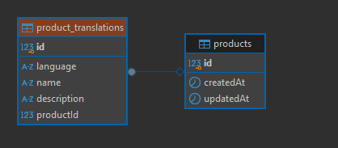

# test-hlab For submit fullstack development test

# Backend Test
## ข้อ 1-2 อยู่ที่
/คำตอบข้อ 1.png
/คำตอบข้อ 2.docx

## ข้อ 3 
Code ใน test-no-3

Create Product
```bash
curl --location 'http://localhost:3000/products' \
--header 'Content-Type: application/json' \
--data '{
  "translations": [
    {
      "language": "en",
      "name": "Test Product",
      "description": "This is a test product description in English."
    },
    {
      "language": "fr",
      "name": "Produit de Test",
      "description": "Ceci est une description de produit de test en français."
    },
    {
      "language": "es",
      "name": "Producto de Prueba",
      "description": "Esta es una descripción del producto de prueba en español."
    }
  ]
}
'
```

Search Product
```bash
curl --location 'http://localhost:3000/products/search?query=Test&language=en&page=1&limit=5' \
--header 'Content-Type: application/json'
```

## DB Design

### Schema Structure

Diagram Image:


#### relation:  1-to-many
#### 1 product can has many product_translation

Product Table:

Stores metadata about the product, such as creation date, update date, and unique product identifier.
Example:

```sql
CREATE TABLE products (
    id SERIAL PRIMARY KEY,
    created_at TIMESTAMP DEFAULT CURRENT_TIMESTAMP,
    updated_at TIMESTAMP DEFAULT CURRENT_TIMESTAMP
);
```
ProductTranslation Table:

Stores the multilingual attributes (name, description) and the language code for each product.
Has a foreign key to the products table to maintain a relationship.
Example:
```sql
CREATE TABLE product_translations (
    id SERIAL PRIMARY KEY,
    product_id INT NOT NULL,
    language VARCHAR(5) NOT NULL, -- e.g., "en", "fr", "es"
    name VARCHAR(255) NOT NULL,
    description TEXT NOT NULL,
    CONSTRAINT fk_product FOREIGN KEY (product_id) REFERENCES products(id) ON DELETE CASCADE,
    UNIQUE (product_id, language) -- Ensures no duplicate translations for the same product
);
```

## Testing Strategy
Testing ensures the APIs are robust, performant, and meet the functional requirements. We employ three types of testing: Unit Testing, Integration Testing, and End-to-End Testing (E2E).

### 1. Unit Testing
Objective
To test individual components like services, validation logic, and database queries in isolation.

Approach
Mock Dependencies: Use mocks or stubs for external dependencies like the database (e.g., mocking the TypeORM repository).
Focus: Test service methods, DTO validation, and any utility functions.
Tools
Jest (default in NestJS) for test writing and assertions.
MockRepository or libraries like jest-mock-extended to mock database interactions.

Note:
Example test in test directory.

### 2. Integration Testing
Objective
To test the interaction between various parts of the application, such as controllers, services, and database repositories.

Approach
Use a test database to execute real queries and ensure the database schema works as expected.
Write tests for the API endpoints to ensure they handle requests and responses correctly.
Tools
NestJS Testing Utilities: Provide access to the application’s modules during testing.
SQLite (in-memory) or a dedicated Postgres instance for testing.

### 3. End-to-End (E2E) Testing
Objective
To test the complete workflow, including user interactions, API requests, and database persistence.

Approach
Simulate HTTP requests using tools like Supertest.
Ensure that the request reaches the intended API endpoint, processes the logic correctly, and interacts with the database as expected.


## Test Coverage
To ensure full coverage, include:

Validation Tests: Verify DTOs handle valid and invalid data correctly.
Edge Cases: Test scenarios like empty translations, unsupported languages, and large paginated requests.
Error Handling: Test scenarios where the database is unavailable or input data is malformed.


# React Question
### 1. useCallback ใช้ทําอะไร

- เป็น Hook ใน React ช่วยลดการ เรนเดอร์ ถ้า Dependecies ไม่มีการเปลี่ยนแปลง  เพื่อหลีกเลี่ยงการสร้างฟังก์ชันใหม่ในทุกครั้งที่คอมโพเนนต์ถูกเรนเดอร์ใหม่ โดยเฉพาะเมื่อเราส่งฟังก์ชันนั้นเป็น props ให้กับ Child Component

- ช่วยลดการเรนเดอร์ที่ไม่จำเป็นใน Child Component ที่ใช้ React.memo
- ใช้เมื่อต้องการส่งฟังก์ชันเป็น props และต้องการให้ Child Component จดจำฟังก์ชันเดิม


2. Write a unit test for the UserProfile React component using Jest and React Testing
Library.
```javascript
import React, { useState, useEffect } from "react";
const UserProfile = ({ userId }) => {
  const [user, setUser] = useState(null);
  const [error, setError] = useState("");
  useEffect(() => {
    const fetchData = async () => {
      try {
        const response = await fetch(`https://api.example.com/users/${userId}`);
        if (!response.ok) {
          throw new Error("Failed to fetch user data");
        }
        const userData = await response.json();
        setUser(userData);
      } catch (err) {
        setError(err.message);
      }
    };
    fetchData();
  }, [userId]);
  if (error) {
    return <div>Error: {error}</div>;
  }
  if (!user) {
    return <div>Loading...</div>;
  }
  return (
    <div>
      <h1>{user.name}</h1>
      <p>Email: {user.email}</p>
    </div>
  );
};

export default UserProfile;
```

### Ans

```javascript
// Mock the fetch API
global.fetch = jest.fn();

describe('UserProfile Component', () => {
  afterEach(() => {
    jest.clearAllMocks();
  });

  test('displays loading message initially', () => {
    render(<UserProfile userId="1" />);
    expect(screen.getByText(/Loading.../i)).toBeInTheDocument();
  });

  test('renders user data correctly after fetch', async () => {
    // Mock
    const mockUserData = { name: 'Test', email: 'test@example.com' };
    fetch.mockResolvedValueOnce({
      ok: true,
      json: async () => mockUserData,
    });

    render(<UserProfile userId="1" />);

    // Wait for the user data to appear
    expect(await screen.findByText('Test')).toBeInTheDocument();
    expect(screen.getByText(/Email: test@example.com/i)).toBeInTheDocument();
  });

  test('displays error message when fetch fails', async () => {
    // Mock failed response
    fetch.mockResolvedValueOnce({
      ok: false,
    });

    render(<UserProfile userId="1" />);

    // Wait error message show
    expect(await screen.findByText(/Error: Failed to fetch user data/i)).toBeInTheDocument();
  });

  test('displays error message when fetch throws an exception', async () => {
    // Mock fetch thrown an error
    fetch.mockRejectedValueOnce(new Error('Network error'));

    render(<UserProfile userId="1" />);

    // Wait for error message show
    expect(await screen.findByText(/Error: Network error/i)).toBeInTheDocument();
  });
});

```